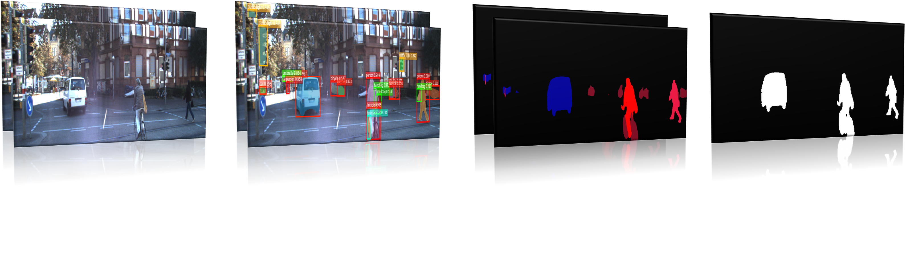

# Moving Object Detection dataset for Urban Driving Scenes

A new dataset for moving object detection is developed that covers all the dynamic objects like, all types of vehicles, pedestrians, bicyclists, train, buses, motorcyclists, etc. Existing available datasets for moving object detection only focused on vehicles with car, truck, and van object categories.

The more accurate and a practical way of detecting moving object in vision tasks is by understanding the motion across two sequential images. We used several sequences from KITTI-raw and EU long-term datasets to prepare a total of 10059 binary mask images (having static/moving objects) with corresponding annotated binary mask labels (having moving objects only). Each binary mask label for moving objects is build from corresponding sequence pair images.

Please refer to our [paper]() for more details on dataset preparation and details.

# Download

Click [here]() to download the dataset. 

The provided data is the motion masks only where the corresponding RGB frames are found in [KITTI](http://www.cvlibs.net/datasets/kitti/raw_data.php) and [EU long-term](https://epan-utbm.github.io/utbm_robocar_dataset/)

# Citing MOD Dataset
If you find this dataset useful in your work, please cite the paper: 

Paper on [UTBM]() 

## Dataset sample frames

# Contributions
If you find any mistakes in the labels, you can report it in the issues section.

# Acknowledgements
University Technology Belfort-Montbrliard, France [UTBM](https://www.utbm.fr/)
Connaissance et Intelligence Artificielle Distribuées [CIAD](http://www.ciad-lab.fr/)

# Inspiration
We hope that this will benefit the community and researchers working in the field of autonomous driving.
